<p align="center">
  
</p>

<p align="center">
  <strong>A minimalist coding-assistant CLI built on Vercel's <code>ai-sdk</code>. Small core, nine extension categories, deterministic state-machine workflows.</strong>
</p>

<p align="center">
  <a href="https://www.npmjs.com/package/stud-cli"></a>
  <a href="https://www.npmjs.com/package/stud-cli"></a>
  <a href="https://github.com/Z-M-Huang/stud-cli"></a>
  <a href="https://github.com/Z-M-Huang/stud-cli/issues"></a>
  <a href="https://github.com/Z-M-Huang/stud-cli/blob/main/LICENSE"></a>
</p>

<p align="center">
  =22" />
  
  
  
  
</p>

<p align="center">
  <a href="#why-it-exists">Why</a> &nbsp;·&nbsp;
  <a href="#three-tenets">Three Tenets</a> &nbsp;·&nbsp;
  <a href="#status">Status</a> &nbsp;·&nbsp;
  <a href="#install">Install</a> &nbsp;·&nbsp;
  <a href="#usage">Usage</a> &nbsp;·&nbsp;
  <a href="#architecture">Architecture</a> &nbsp;·&nbsp;
  <a href="#contributing">Contributing</a> &nbsp;·&nbsp;
  <a href="#license">License</a>
</p>

---

## Why it exists

Most coding CLIs hard-wire one provider, one toolset, and one workflow — integration is a fork. And the LLM is treated as the author of the workflow, which means the workflow drifts whenever the model does.

**stud-cli** inverts both: the core is a tiny plugin host, and **[State Machines](https://github.com/Z-M-Huang/stud-cli/wiki/State-Machines)** are a first-class extension category with authority over turn progression. The LLM executes; code the user wrote holds authority.

## Three tenets

| Tenet                           | What it means                                                                                                                                                                                                                                                                                                                        |
| ------------------------------- | ------------------------------------------------------------------------------------------------------------------------------------------------------------------------------------------------------------------------------------------------------------------------------------------------------------------------------------ |
| **Small core, many extensions** | Core owns the message loop, event bus, session format, context assembly, registries, env provider, host API, extension lifecycle, configuration scopes, security modes, MCP client, and discovery. Everything else is an extension. See [Extensibility Boundary](https://github.com/Z-M-Huang/stud-cli/wiki/Extensibility-Boundary). |
| **Deterministic over magical**  | State Machines govern turn progression. The LLM does not drive the workflow; the SM does. See [State Machines](https://github.com/Z-M-Huang/stud-cli/wiki/State-Machines) and the [State Machine Workflow flow](https://github.com/Z-M-Huang/stud-cli/wiki/State-Machine-Workflow).                                                  |
| **Trust is a real boundary**    | Entering a new project triggers a [first-run trust prompt](https://github.com/Z-M-Huang/stud-cli/wiki/Project-Trust). Environment and settings values do not enter the LLM request by default. See [LLM Context Isolation](https://github.com/Z-M-Huang/stud-cli/wiki/LLM-Context-Isolation).                                        |

## Status

`0.0.1` is a **name reservation** on npm. No usable features ship yet; the architecture is being stood up first.

| Phase                                 | Scope                                                               | State       |
| ------------------------------------- | ------------------------------------------------------------------- | ----------- |
| Core types + error model              | Contract meta-shape, 9 contract interfaces, 8 typed error classes   | Planning    |
| Lifecycle + registries + message loop | Stage pipeline, per-category registries, validation                 | Planning    |
| Provider + Tools + UI (bundled)       | First-party provider, default toolset, reference TUI                | Planning    |
| Security + Session Store + audit      | Trust prompt, allowlist / ask / yolo, filesystem store, audit trail | Planning    |
| State Machines + MCP                  | Stage definitions, `grantStageTool`, MCP client                     | Planning    |
| `0.1.0` — first usable release        | Everything above + CI + packaging                                   | Not started |

Track progress on [GitHub Issues](https://github.com/Z-M-Huang/stud-cli/issues) and the [wiki](https://github.com/Z-M-Huang/stud-cli/wiki).

## Install

```bash
npm install -g stud-cli
```

> `0.0.1` is a placeholder release. Installing gives you a CLI that prints its version and a status notice — nothing else yet.

## Usage

```bash
stud-cli            # prints a placeholder notice
stud-cli --version  # prints the current version
```

## Architecture

stud-cli is a plugin-host runtime with **nine extension categories**: Providers, Tools, Hooks, UI, Loggers, State Machines, Commands, Session Stores, and Context Providers. Each category is typed, versioned, and validated at load.

```mermaid
flowchart LR
    User[User]:::actor
    LLM[LLM backend]:::actor
    FS[(Filesystem)]:::actor
    MCPsrv[MCP server]:::actor

    subgraph Core[stud-cli core]
        direction TB
        Kernel[Message loop<br/>Host API<br/>Interaction protocol<br/>Session format<br/>Context assembly<br/>Registries<br/>Env provider<br/>Security modes<br/>MCP client<br/>Observability<br/>Discovery + validation]
    end

    subgraph Ext[Nine extension categories]
        direction TB
        Providers[Providers]
        Tools[Tools]
        Hooks[Hooks]
        UI[UI]
        Loggers[Loggers]
        SM[State Machines]
        Cmds[Commands]
        Stores[Session Stores]
        CtxP[Context Providers]
    end

    User -- "input / output" --- UI
    UI -- "events + interaction" --- Core
    Cmds -- "dispatch" --- Core
    Providers -- "adapter" --- Core
    Providers -- "requests" --- LLM
    Tools -- "tool calls" --- Core
    Hooks -- "stage interception" --- Core
    Loggers -- "sink" --- Core
    SM -- "authority" --- Core
    Stores -- "persistence" --- Core
    Stores -- "read / write" --- FS
    CtxP -- "context fragments" --- Core
    Core -- "MCP client" --- MCPsrv

    classDef actor fill:#eef,stroke:#447,color:#112
```



**Full architecture documentation lives in the [wiki](https://github.com/Z-M-Huang/stud-cli/wiki).** Start with whichever matches your intent:

- [High-Level Architecture](https://github.com/Z-M-Huang/stud-cli/wiki/High-Level-Architecture) — the one-page overview.
- [Contract Pattern](https://github.com/Z-M-Huang/stud-cli/wiki/Contract-Pattern) — the meta-shape every extension category conforms to.
- [Message Loop](https://github.com/Z-M-Huang/stud-cli/wiki/Message-Loop) — the six-stage turn lifecycle.
- [State Machines](https://github.com/Z-M-Huang/stud-cli/wiki/State-Machines) — the category that holds workflow authority.
- [Trust Model](https://github.com/Z-M-Huang/stud-cli/wiki/Trust-Model) — scopes, project trust, extension isolation posture.
- [Reading Paths](https://github.com/Z-M-Huang/stud-cli/wiki/Reading-Paths) — audience-based tours through the wiki.

## Contributing

The wiki is the architecture source of truth. Before opening a PR, read [`CLAUDE.md`](./CLAUDE.md) and the rules in [`.claude/rules/`](./.claude/rules/). Contract changes require a `contractVersion` bump on the matching wiki page — see [Versioning and Compatibility](https://github.com/Z-M-Huang/stud-cli/wiki/Versioning-and-Compatibility).

Open an issue first to discuss non-trivial changes: [GitHub Issues](https://github.com/Z-M-Huang/stud-cli/issues).

## License

[Apache-2.0](./LICENSE).

---

<p align="center">
  <sub>Built with Claude Code. Not affiliated with or endorsed by Anthropic.</sub>
</p>
